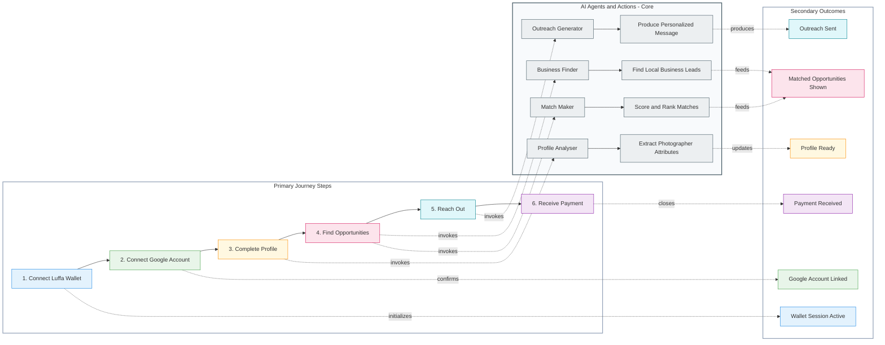

# PhotoPal

This project was built as part of the [Encode AI London Hackathon 2026](https://www.encodeclub.com/programmes/ai-london-2026).


PhotoPal is an agentic AI platform that helps photographers analyse their portfolio, discover qualified business leads, match opportunities to their style, and generate tailored outreach drafts.

Built on Luffa App and secured by Civic, the product combines a client experience with AI agents that run structured research workflows and persist results to Supabase.

## Table of Contents

- [Why PhotoPal](#why-photopal)
- [Core Features](#core-features)
- [System Architecture](#system-architecture)
- [AI Agents](#ai-agents)
- [Tech Stack](#tech-stack)
- [Project Structure](#project-structure)
- [Setup](#setup)
    - [1) Clone the Repository](#1-clone-the-repository)
    - [2) Setup Python Virtual Environment](#2-setup-python-virtual-environment)
    - [3) Setup ngrok (Optional)](#3-setup-ngrok-optional)
    - [4) Backend Setup (FastAPI + Agents)](#4-backend-setup-fastapi--agents)
    - [5) Luffa App Setup](#5-luffa-app-setup)
    - [6) Download Luffa and Use the App](#6-download-luffa-and-use-the-app)
- [Workflow](#workflow)
- [API Endpoints](#api-endpoints)
- [Authentication Endpoints](#authentication-endpoints)
- [Authentication Notes](#authentication-notes)
- [Technical Limitations](#technical-limitations)
- [References](#references)

## Why PhotoPal

Photographers often spend too much time on manual prospecting and generic outreach.
PhotoPal automates that workflow in four steps:

1. Analyse a photographer portfolio to understand market fit and positioning.
2. Find nearby businesses that likely need visual content.
3. Match the best opportunities to each photographer profile.
4. Generate personalized outreach drafts mapped to each matched lead.

## Core Features

- Portfolio analysis into structured profile data.
- Agentic business discovery for local opportunities.
- Profile-to-business fit matching.
- Business-level research and outreach draft generation.
- Civic-backed auth and token exchange support.
- Supabase persistence for businesses, profiles, and drafts.
- Luffa mini app UI for onboarding and opportunity review.

## System Architecture

PhotoPal is split into two main applications:

- LuffaApp mini program frontend
	- Photographer onboarding and profile intake.
	- Suggested opportunities list and map links.
	- Calls backend agent endpoints.
- Python FastAPI backend
	- Agent endpoints under /agents/*.
	- Civic auth routes and device flow helpers.
	- LangGraph-based agents with MCP tools.
	- Supabase persistence for agent outputs.

## AI Agents

### 1) Profile Analyser

- Input: portfolio website and optional Instagram handle.
- Output: structured photographer profile attributes.
- Target table: photographer_profiles.

### 2) Business Finder

- Input: area or city.
- Output: structured local business leads.
- Target table: businesses.

### 3) Match Maker

- Input: photographer profile + location-bassed discovered business leads.
- Output: prioritised profile-to-business matches with fit rationale.
- Role: ranking layer between discovery and outreach.

### 4) Outreach Generator

- Input: business id and photographer profile id.
- Output: fit scoring, research summary, and custom cold outreach draft.
- Target table: business_outreach_emails.

## Tech Stack

- Frontend: Luffa mini program (JavaScript, WXML, WXSS).
- Backend API: FastAPI + Uvicorn.
- Agent runtime: LangGraph + LangChain MCP adapters.
- Model: Gemini via langchain_google_genai.
- Data layer: Supabase.
- Auth and identity: Civic OAuth and token exchange.

## Project Structure

```
PhotoPal/
	backend/
		agents/
			lead_finder.py
			portfolio_analyser.py
			business_outreach_researcher.py
			main.py
			civic_token_exchange.py
		api/
			server.py
			routes/
				lead_finder.py
				portfolio_analyser.py
				business_outreach.py
				auth_utils.py
		core/
			supabase_client.py
		requirements.txt

	LuffaApp/
		config/
			agent_api.js
			supabase.js
			maps.js
			env.generated.js
		pages/
			profile-intake/
			suggested-opportunities/
			settings/
			profile/
			index/
			webview/
		scripts/
			sync-env-to-config.js
```

## Setup

## 1) Clone the Repository

```bash
git clone https://github.com/Encode-Club-AI-Hackathon/PhotoPal.git
```

## 2) Setup Python Virtual Environment

Change directory to `backend`, create a virtual enviironment and install the requirements:

```bash
cd PhotoPal/backend
python -m venv .venv
source .venv/bin/activate
pip install -r requirements.txt
```

## 3) Setup ngrok (Optional)

If you are only testing backend calls on your own machine, localhost is enough. For Luffa mini app testing on a real device and OAuth callback flows, ngrok is recommended.

Install ngrok (macOS):

```bash
brew install ngrok
```

Authenticate ngrok once:

```bash
ngrok config add-authtoken YOUR_NGROK_AUTHTOKEN
```

Expose your local FastAPI server:

```bash
ngrok http 8000
```

Copy the `https://...ngrok-free.dev` forwarding URL and use it in both backend and Luffa app configs.

Why this matters:

- Mobile clients cannot call your local `http://127.0.0.1:8000` directly.
- OAuth providers (Civic/Google) require reachable callback URLs, not localhost on your laptop.
- A single public HTTPS URL keeps backend auth redirects and frontend API calls aligned during development.

## 4) Backend Setup (FastAPI + Agents)

Create `backend/.env` with the required values:

```env
CIVIC_CLIENT_ID = YOUR_CIVIC_CLIENT_ID
CIVIC_CLIENT_SECRET = YOUR_CIVIC_CLIENT_SECRET
CIVIC_TOKEN = YOUR_CIVIC_TOKEN
CIVIC_URL = YOUR_CIVIC_URL

GOOGLE_API_KEY = YOUR_GOOGLE_API_KEY
GOOGLE_OAUTH_CLIENT_ID = YOUR_GOOGLE_OAUTH_CLIENT_ID
GOOGLE_OAUTH_REDIRECT_URL = YOUR_GOOGLE_OAUTH_REDIRECT_URL -- If ngrok is set up: https://YOUR-NGROK-URL.ngrok-free.dev/google/callback
GOOGLE_OAUTH_CLIENT_SECRET = YOUR_GOOGLE_OAUTH_CLIENT_SECRET

SUPABASE_URL = YOUR_SUPABASE_URL
SUPABASE_KEY = YOUR_SUPABASE_KEY

PUBLIC_BASE_URL = YOUR_PUBLIC_BASE_URL -- If ngrok is set up: https://YOUR-NGROK-URL.ngrok-free.dev/

CIVIC_SCOPES=openid,email,profile,https://mail.google.com/,https://www.googleapis.com/auth/gmail.modify,https://www.googleapis.com/auth/gmail.compose,https://www.googleapis.com/auth/gmail.addons.current.action.compose,https://www.googleapis.com/auth/gmail.addons.current.message.action,https://www.googleapis.com/auth/gmail.readonly,https://www.googleapis.com/auth/gmail.metadata,https://www.googleapis.com/auth/gmail.insert,https://www.googleapis.com/auth/gmail.addons.current.message.metadata,https://www.googleapis.com/auth/gmail.addons.current.message.readonly,https://www.googleapis.com/auth/gmail.send,https://www.googleapis.com/auth/gmail.labels,https://www.googleapis.com/auth/gmail.settings.basic,https://www.googleapis.com/auth/gmail.settings.sharing
```

Run the API:

```bash
uvicorn api.server:app --reload --host 0.0.0.0 --port 8000
```

In a separate terminal, do a health check:

```bash
curl http://localhost:8000/health
```

You should get back:

```bash
{"status": "ok"}
```


## 5) Luffa App Setup

Inside `LuffaApp`, create a local `.env` file from the example:

```env
LUFFA_SUPABASE_URL = YOUR_LUFFA_SUPABASE_URL
LUFFA_SUPABASE_ANON_KEY = YOUR_LUFFA_SUPABASE_ANON_KEY
LUFFA_MAPBOX_ACCESS_TOKEN = YOUR_LUFFA_MAPBOX_ACCESS_TOKEN
LUFFA_MAPBOX_STYLE_ID = mapbox/streets-v12
LUFFA_AGENT_API_BASE_URL = YOUR_LUFFA_AGENT_API_BASE_URL -- If ngrok is set up: https://YOUR-NGROK-URL.ngrok-free.dev/
```

Generate runtime config for the mini program:

```bash
node scripts/sync-env-to-config.js
```

## 6) Download Luffa and Use the App

Use [this](https://uk.luffa.im/docs/quickStartGuide/quickStartGuide.html) documentation to install the Luffa SuperBox and import the project.

## Workflow



## API Endpoints

All agent endpoints are mounted under /agents.

### POST /agents/lead-finder

Request:

```json
{
	"area": "Bristol, UK"
}
```

### POST /agents/portfolio-analyser

Request:

```json
{
	"website_url": "https://example-portfolio.com",
	"instagram_handle": "photographer_handle",
	"photographer_id": "wallet_uid"
}
```

### POST /agents/business-outreach

Request:

```json
{
	"business_id": 123,
	"photographer_id": 456
}
```

### POST /agents/business-matcher

Request:

```json
{
	"photographer_id": "wallet_uid",
	"city": "Bristol",
	"radius_km": 20,
	"limit": 5,
	"use_cache": true,
	"excluded_business_ids": [101, 102]
}
```

### POST /agents/send-gmail

Request:

```json
{
	"to_email": "owner@business.com",
	"subject": "Quick idea for your brand visuals",
	"body": "Hi, I had a look at your online presence and have a few visual ideas...",
	"outreach_email_id": 123
}
```

### POST /agents/save-gmail-draft

Request:

```json
{
	"to_email": "owner@business.com",
	"subject": "Quick idea for your brand visuals",
	"body": "Hi, I had a look at your online presence and have a few visual ideas...",
	"outreach_email_id": 123
}
```

## Custom Auth Solution Endpoints

These endpoints are exposed by the backend auth server in addition to the `/agents/*` routes.

- `GET /`: Returns tokens (and finalizes device session when applicable).

### Device Login Flow

- `POST /auth/device/start`: Create a device login session and return verification URL + user code.
- `GET /auth/device/verify?session_id=...`: Render verification page and start Google login handoff.
- `GET /auth/device/status?session_id=...`: Poll session status and retrieve approved tokens/profile.

### Google OAuth Flow

- `GET /auth/google/login?session_id=...`: Start Google OAuth for an active device session.
- `GET /auth/google/callback`: Google OAuth callback endpoint.

### Token Exchange

- `POST /auth/civic/exchange`: Exchange a subject token for a Civic access token.

Request:

```json
{
	"subject_token": "<jwt-or-provider-token>"
}
```

## Authentication Notes

- Logout is finalised client-side by removing the stored auth token and clearing the device session id.
- Agent routes accept Bearer tokens and can exchange non-Civic subject tokens for Civic access tokens.
- In local hackathon mode, a static CIVIC_TOKEN fallback is supported.

## Technical Limitations

- Luffa mini app navigation constraints: you cannot reliably deep-link/link users to websites or external applications outside the mini app container.
- No DOM access or DOM manipulation: standard browser DOM patterns are unavailable in the mini app runtime.
- Limited ecosystem compatibility: complex external packages are harder to use due to mini app runtime and bundling constraints.
- Civic auth scope limitation for this use case: we could not pass all required scopes needed for both sending and receiving emails in the expected flow.
- Civic tool API key UX gap: when a Civic tool has no API key configured, the flow asks for manual plain-text instructions and a link-based handoff; this would be better handled via an interceptable tool call.
- Civic Python library maturity and documentation gap: docs are limited, and one relevant library release landed one day before the hackathon.
- Civic guardrail management bug: adding a guardrail to a skill via the Civic web UI failed, and we had to use the AI chatbot as a workaround.


## References

- [LuffaMiniApp_Template GitHub Repositroy](https://github.com/BabyBoss45/LuffaMiniApp_Template/tree/main)
- [Luffa SuperBox Documentation](https://uk.luffa.im/docs/quickStartGuide/quickStartGuide.html)
- [Civic Documentation](https://docs.civic.com/?_gl=1*zq7beh*_up*MQ..*_ga*MTk2ODEzMzAyMS4xNzc0MTU3Njgy*_ga_EN41CJBWQV*czE3NzQxNTc2ODIkbzEkZzAkdDE3NzQxNTc2ODIkajYwJGwwJGgzOTE3MzU1NzY.)
